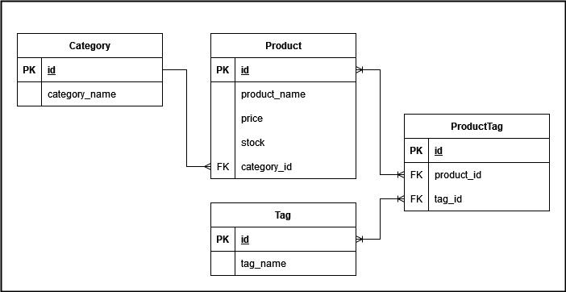

# E-commerce Back End Demo - Ez Buy API

Welcome to Team Page Generator!  An App that lets you generator your own Team web page as a manager.

Checkout the demo video [here](https://drive.google.com/file/d/1P5Zzf8OtHsWWmjOrhtGoCPF44HpwMzkX/view?usp=sharing)


## Table of Contents

1. [Technology Used](#technology-used)
1. [Overview and Strategies](#overview-and-strategies)
1. [Learning Points](#learning-points)
1. [Author Info](#author-info)
1. [License](#license)


## Technology Used 

| Technology | Resource URL | 
| ------------- | ------------- | 
| Express | [https://expressjs.com/](https://expressjs.com/) |
| Node.js | [https://nodejs.org/en/docs/](https://nodejs.org/en/docs/) |
| Sequelize | [https://sequelize.org/](https://sequelize.org/) |
| MySQL | [https://www.mysql.com/](https://www.mysql.com/)
| JS | [https://developer.mozilla.org/en-US/docs/Web/JavaScript](https://developer.mozilla.org/en-US/docs/Web/JavaScript) |
| Git | [https://git-scm.com/](https://git-scm.com/) |


## Overview and Strategies

A general overview of the application flow is:
1. Start the program
1. Run the seed script
1. Connect to your web browser or Insomnia
1. Make API calls to GET, POST, PUT, and DELETE and update the data

Below is the diagram of the database:




## Usage

Once the server is running and the data is seeded, you can use the following APIs to create, view, update and delete.

API List:

| API | Request Type | action |
|-----|--------------|--------|
| ```/api/categories/``` | GET | View all categories |
| ```/api/categories/:id``` | GET | View category by ID |
| ```/api/categories/``` | POST | Create category |
| ```/api/categories/:id``` | PUT | Update category with ID |
| ```/api/categories/``` | DELETE | Delete category |
| ```/api/products/``` | GET | View all products |
| ```/api/products/:id``` | GET | View product by ID |
| ```/api/products/``` | POST | Create product |
| ```/api/products/:id``` | PUT | Update product with ID |
| ```/api/products/``` | DELETE | Delete product |
| ```/api/tags/``` | GET | View all tags |
| ```/api/tags/:id``` | GET | View tag by ID |
| ```/api/tags/``` | POST | Create tag |
| ```/api/tags/:id``` | PUT | Update tag with ID |
| ```/api/tags/``` | DELETE | Delete tag |


## Learning Points 

Sequlize has been a new learning point for me.  Understanding the behind the scenes data manipulation and data queries has been fun.  I'm looking forward to more.

## Author Info

### Brandon Haskell

* [LinkedIn](https://www.linkedin.com/in/BrandonDHaskell)
* [Github](https://github.com/bhaskell7901)


## License

MIT License